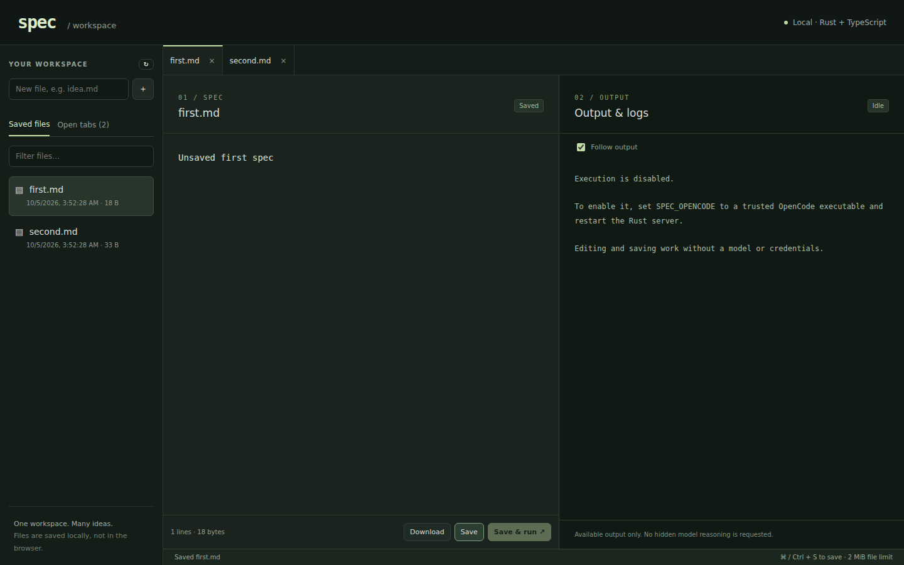

# spec

A local-first **Rust backend + Vite / React / TypeScript frontend** for writing specifications and viewing build output side by side.

This is a source-derived web rewrite of [AI10xDev/specific](https://github.com/AI10xDev/specific), the project behind the development machine's `spec` shell command. “Rust++” was clarified to mean Rust, not a separate language or C++ requirement. The HTTP backend is Rust; optional execution delegates to the existing external `spec` shell launcher. OpenCode is an **optional external execution engine**, not a Rust reimplementation of the model/provider stack.



## Features

- **Saved files tab:** previously written files in the selected workspace, most-recently-modified first, with timestamps, sizes, filtering, and refresh.
- **Multiple editor tabs:** independent buffers, quick switching, dirty indicators, and confirmation before discarding unsaved edits.
- **Two panes:** the active spec on the left; that file's output and logs on the right. Smaller screens stack them vertically.
- **Reliable saves:** atomic replacement, private file permissions, and revision checks that reject stale saves instead of silently overwriting them.
- **Local file workflow:** create, edit, save, reopen, and download UTF-8 files; Ctrl/Cmd+S saves the active editor.
- **Optional Save & run:** explicit confirmation, immutable saved-spec input, live output polling, follow toggle, cancellation, concurrency limits, and a 15-minute timeout.
- **Local API protection:** loopback binding, a random access token, no permissive CORS, constrained filenames, and symlink rejection.

The output pane displays available stdout/stderr and explanations. It does **not** request or expose hidden model chain-of-thought.

Read the [complete feature guide](docs/FEATURES.md), [code review](docs/REVIEW.md), [security notes](docs/SECURITY.md), and [source collection notes](archive/README.md).

## Quick start

Requirements: Linux, Rust/Cargo (tested with 1.98), and Bun (tested with 1.3.14) or Node.js 22.12+ with npm. Bun is recommended for reproducible frontend installs using `bun.lock`; the launcher's npm fallback does not use that lockfile. These tools are used for frontend dependency management/building only. The backend uses Unix file locking and process groups; Windows is not supported by this version.

```sh
git clone https://github.com/ai10xdev/spec.git
cd spec
./run.sh
```

`run.sh` installs frontend dependencies, typechecks/builds the UI, and starts the release Rust server. It can be invoked from any working directory and honors the configuration variables below; relative workspace/UI paths are resolved from `backend/`. Stop it with Ctrl+C.

New workspace directories are private. If an existing workspace is writable by group/others, startup stops without changing its permissions. Choose another trusted directory or explicitly run `chmod go-w -- /path/to/workspace` before retrying.

Open the **full URL printed by the server**, including `#token=…`. Production frontend assets are served by Rust from `frontend/dist`; there is no separate frontend server to start. The default address is `http://127.0.0.1:4780` and the default file workspace is `workspace/` at the repository root. Keep the printed token private.

Create `idea.md` in the left sidebar, enter text, and click **Save**. It now appears in **Saved files**, including after restarting the server. Create or open a second file to get another editor tab.

### Use existing specs

From the repository root, select an existing **trusted, flat directory**:

```sh
SPEC_WORKSPACE="$HOME/specs" ./run.sh
```

The original shell function mirrors specs into `$HOME/specs`, so this can display those previously written files directly. **This edits the selected files in place.** Back them up first if needed. This version does not automatically read `~/.local/state/spec/saved-files` or traverse unrelated paths from that history. Nested folders, hidden files, symlinks, and non-UTF-8 files are not editable.

### Optional execution through `spec build`

Execution is **off by default**. To enable it, configure your existing `spec` shell launcher and its OpenCode provider/model, then start Rust with the launcher’s absolute executable path (not the Rust web-server binary or an interactive shell function):

```sh
# Use your installed spec shell launcher, not backend/target/release/spec.
SPEC_COMMAND="$HOME/.local/bin/spec" \
SPEC_WORKSPACE="$HOME/specs" \
./run.sh
```

The adapter invokes `SPEC_BUILD_AUTO=1 /absolute/path/to/spec build <snapshot-file>` from the workspace. This selects the existing launcher's foreground branch, which forwards to `opencode run --auto --dir "$PWD" --agent build -- <prompt>`. **Automatic tool approval is enabled.** Only run trusted specs: the agent can modify files, execute tools, access the network, and incur provider costs. The UI asks for confirmation before each run, but is not a sandbox or a per-tool approval client.

The saved revision is copied to a private temporary file (`0600`, in a `0700` directory), kept until the run ends and then removed. Later editor saves do not change the running input. The backend passes only the snapshot path as a literal argument—no shell command string or document interpolation—and captures stdout/stderr. Cancellation and the 15-minute timeout kill the process group. The launcher must remain in the foreground and propagate its exit status; a detached shell function is not supported.

Build snapshots are limited to **120 KiB** because the existing launcher forwards the prompt as a single Linux process argument. Editing and saving still support 2 MiB. The launcher’s Bash command substitution strips trailing newlines from the prompt. `SPEC_OPENCODE` no longer enables web execution; migrate to `SPEC_COMMAND` and change the selected executable from OpenCode to the `spec` launcher. There is no implicit PATH lookup or shell-startup sourcing by the backend.

The process adapter is tested with a deterministic local process fixture. No live provider calls were made during validation, so compatibility with a particular provider/CLI release must be checked separately.

### Frontend development

Keep the Rust server on its default port, then in a second terminal:

```sh
cd frontend
bun run dev
```

Open the Vite URL and paste the Rust server's token into the connection form. Vite proxies `/api` to `127.0.0.1:4780`. If you change the backend port for development, update `frontend/vite.config.ts` accordingly.

## Configuration

| Variable | Default | Meaning |
| --- | --- | --- |
| `SPEC_WORKSPACE` | `../workspace` | File directory, relative to the backend process working directory |
| `SPEC_PORT` | `4780` | Loopback HTTP port; `0` chooses an available port |
| `SPEC_UI_DIR` | `../frontend/dist` | Built Vite assets, relative to process working directory |
| `SPEC_COMMAND` | unset | Absolute trusted `spec` shell launcher; unset disables execution; runs with `SPEC_BUILD_AUTO=1` |

There are no credentials bundled in this repository and no automatic service installation. The existing `spec` shell alias is not modified. Run the new binary explicitly from `backend/target/release/spec` if the old shell function shadows its name.

## Validation

Run checks from the respective package directories:

```sh
cd backend
cargo fmt --check
cargo test --locked
cargo clippy --all-targets --locked -- -D warnings
cargo build --locked

cd ../frontend
bun install --frozen-lockfile
bun typecheck
bun run test
bun run build
bunx playwright install chromium
bun run test:e2e
```

Browser tests start isolated real Rust servers and temporary workspaces. They cover authentication, saved files, tabs, conflicts/downloads, in-flight saves, desktop/mobile layouts, and execution streaming/completion/cancellation/failure using a local process fixture. They never use your specs or invoke a model. Screenshots are written under `frontend/test-results/`, not over the documentation image. See [validation results](docs/REVIEW.md#validation).

## Repository layout and scope

```text
backend/       New Rust HTTP API, filesystem layer, process runner, tests
frontend/      New Vite + React TypeScript UI, unit and browser tests
run.sh         Build the frontend and launch the Rust server
docs/          Feature guide, review, security notes, screenshot
archive/       Original source collection and license notices (not executed or bundled)
workspace/     Local user files (created at runtime; gitignored)
```

The **new runtime** is Rust + TypeScript, plus HTML/CSS. `archive/` intentionally preserves legacy languages for review/provenance. Persistent V2 session steering/recovery, Azure completion/ranking, `/eval`, `/telle`, plan mode, and the terminal editor are **not ported into the web app**. This is a scoped web rewrite, not a feature-complete replacement for all original integrations.

The private repository is independently created rather than a GitHub fork-network entry. Its source ancestry and captured working-tree revisions are recorded in `archive/manifest.json`.

## License

The new application is MIT licensed. Original sources retain their own notices: `specific` MIT; Kibi MIT OR Apache-2.0; OpenCode MIT. The archived machine launcher carries provenance without an implied new license grant. See [NOTICE](NOTICE).
