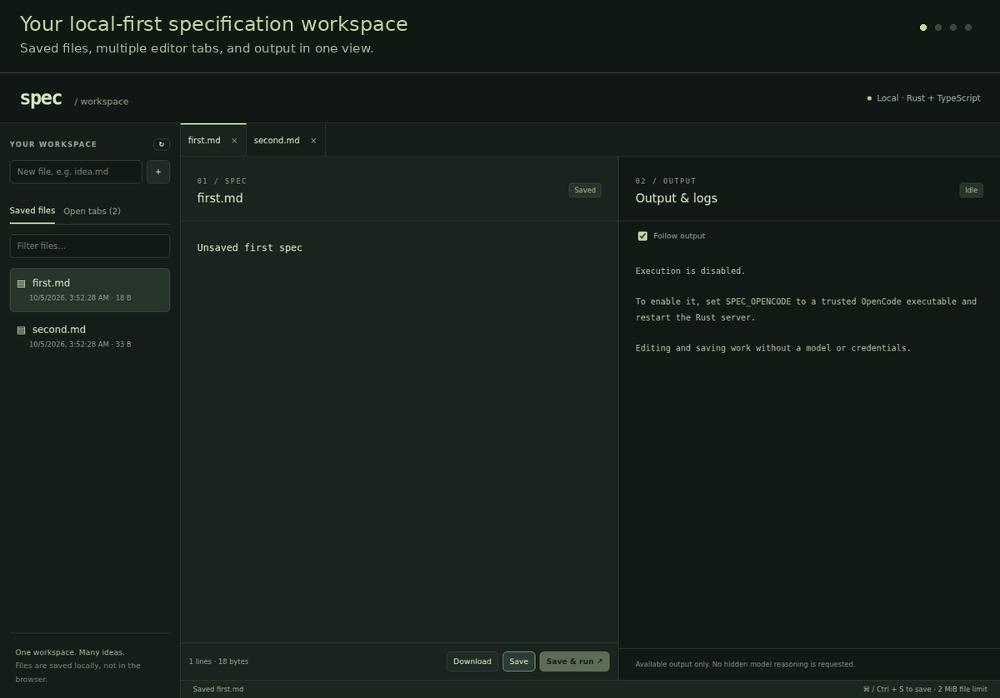

# spec

A local-first **Rust backend + Vite / React / TypeScript frontend** for writing specifications and viewing build output side by side.

This is a source-derived web rewrite of [AI10xDev/specific](https://github.com/AI10xDev/specific), the project behind the development machine's `spec` shell command. “Rust++” was clarified to mean Rust, not a separate language or C++ requirement. The HTTP backend is Rust; optional execution delegates over SSH to the remote `spec build` alias/function. OpenCode is an **optional external execution engine**, not a Rust reimplementation of the model/provider stack.

## Workspace showcase



[View the original screenshot](Screenshot%20From%202026-10-05%2019-07-10.png). This looping tour uses the October 5, 2026 screenshot to highlight saved files, multiple editor tabs, and side-by-side specification editing and completed remote SSH build output. It is an animated screenshot showcase, not a live execution recording.

## Features

- **Saved files tab:** previously written files in the selected workspace, most-recently-modified first, with timestamps, sizes, filtering, and refresh.
- **Multiple editor tabs:** independent buffers, quick switching, dirty indicators, and confirmation before discarding unsaved edits.
- **Two panes:** the active spec on the left; that file's output and logs on the right. Smaller screens stack them vertically.
- **Reliable saves:** atomic replacement, private file permissions, and revision checks that reject stale saves instead of silently overwriting them.
- **Local file workflow:** create, edit, save, reopen, and download UTF-8 files; Ctrl/Cmd+S saves the active editor.
- **Trailing completions:** optional Azure-powered ghost text for the current sentence part; Tab or **Accept part** inserts it, Escape dismisses it.
- **Optional Save & run:** explicit confirmation, immutable saved-spec input, live output polling, follow toggle, cancellation, concurrency limits, and a 15-minute timeout.
- **Local API protection:** loopback binding, a random access token, no permissive CORS, constrained filenames, and symlink rejection.

The output pane displays available stdout/stderr and explanations. It does **not** request or expose hidden model chain-of-thought.

Read the [complete feature guide](docs/FEATURES.md), [code review](docs/REVIEW.md), [security notes](docs/SECURITY.md), and [source collection notes](archive/README.md).

## Quick start

Requirements: Linux, Rust/Cargo (tested with 1.98), and Bun (tested with 1.3.14) or Node.js 22.12+ with npm. Bun is recommended for reproducible frontend installs using `bun.lock`; the launcher's npm fallback does not use that lockfile. These tools are used for frontend dependency management/building only. The backend uses Unix file locking and process groups; Windows is not supported by this version.

```sh
gh repo clone ai10xdev/spec
cd spec
./run.sh
```

`run.sh` installs frontend dependencies, typechecks/builds the UI, and starts the release Rust server. It can be invoked from any working directory and honors the configuration variables below; relative workspace/UI paths are resolved from `backend/`. Stop it with Ctrl+C.

New workspace directories are private. If an existing workspace is writable by group/others, startup stops without changing its permissions. Choose another trusted directory or explicitly run `chmod go-w -- /path/to/workspace` before retrying.

Open the **full URL printed by the server**, including `#token=…`. Production frontend assets are served by Rust from `frontend/dist`; there is no separate frontend server to start. The default address is `http://127.0.0.1:4780` and the default file workspace is `workspace/` at the repository root. Keep the printed token private.

Create `idea.md` in the left sidebar, enter text, and click **Save**. It now appears in **Saved files**, including after restarting the server. Create or open a second file to get another editor tab.

### Use existing specs

From the repository root, select an existing **trusted, flat directory**:

```sh
SPEC_WORKSPACE="$HOME/specs" ./run.sh
```

The original shell function mirrors specs into `$HOME/specs`, so this can display those previously written files directly. **This edits the selected files in place.** Back them up first if needed. This version does not automatically read `~/.local/state/spec/saved-files` or traverse unrelated paths from that history. Nested folders, hidden files, symlinks, and non-UTF-8 files are not editable.

### Remote execution through `spec build` (local web server)

The **browser, Rust web backend, and editable workspace run on your local computer**. Only **`spec build <snapshot-file>` runs on the remote machine over SSH**. No remote web backend, HTTP port forwarding, or remote frontend build is needed.

Execution is off until an SSH target and remote build directory are configured. On your **local computer**, start the app like this:

```sh
# One-time SSH setup: connect interactively and verify the host fingerprint
# through a trusted channel before accepting it. Load an encrypted key into
# ssh-agent if necessary; builds cannot prompt for passwords/passphrases.
ssh -i "$HOME/.ssh/spec_ed25519" user@build-host
# Exit the remote shell, then run these commands LOCALLY:
unset SPEC_COMMAND
SPEC_SSH_TARGET="user@build-host" \
SPEC_SSH_KEY="$HOME/.ssh/spec_ed25519" \
SPEC_SSH_WORKSPACE="/home/user/project" \
SPEC_WORKSPACE="$HOME/specs" \
./run.sh
```

Adjust the host, local key path, and remote project directory for your environment. `SPEC_SSH_TARGET` also accepts a trusted host alias from your local SSH configuration (including its port/ProxyJump settings). Omit `SPEC_SSH_KEY` to use your SSH agent/default identities. Keep private keys **on the local computer**; never paste key contents into a spec or commit them. Builds use batch SSH with strict host-key checking, no TTY, no agent/X11 forwarding, and no port forwarding. Unknown hosts, inaccessible keys, and connection/authentication errors fail the run and appear in its output; they do not fall back to local execution.

Open the full localhost URL printed by the **local** Rust server, including its token. **Save & run** first saves locally, then sends just that immutable spec snapshot over SSH. Other local project files are **not synced**. The remote build works in `SPEC_SSH_WORKSPACE`; its file changes remain remote. Prepare that remote checkout separately. `SPEC_WORKSPACE` is the local editor directory and is independent of the remote build directory.

#### Remote shell requirements

The remote machine needs Linux, Bash, `setsid`, GNU coreutils (including `stdbuf`), findutils, and a configured `spec` build alias/function (or shell launcher on PATH) with its engine/provider credentials. It does **not** need this Rust web server or Bun/Vite for the web UI.

The adapter explicitly sources the trusted remote **`~/.bash_aliases`** in noninteractive Bash with alias expansion enabled, then invokes only:

```sh
export SPEC_BUILD_FOREGROUND=1 SPEC_BUILD_AUTO=1
export OPENCODE_PERMISSION_AUTO_ALLOW_ALWAYS=1 OPENCODE_QUESTION_AUTO_RECOMMEND=1
spec build "$snapshot"
```

Before sourcing that file, the adapter prepends the remote user's `~/.local/bin` and `~/.bun/bin` to `PATH` so user-installed engines are available to child launchers. If your alias/function is defined elsewhere, arrange for `~/.bash_aliases` to source its trusted definition and set the required engine PATH. Interactive `.bashrc` and login profiles are not loaded by the adapter; definitions guarded by an interactive-shell check will not work. The `spec` command must remain in the foreground, propagate its exit status, and accept an explicit snapshot filename. Do not resolve `spec` to the Rust web-server binary. The archived scripts are provenance, not installed configuration, and are not modified or automatically sourced.

If a build reports `run-spec.sh: ... opencode-source: command not found`, the remote launcher was found but its engine was not. Verify that `opencode-source` is installed and executable **on the remote host**. For a custom installation, add an exported PATH to the remote `~/.bash_aliases`, outside any interactive-shell guard:

```sh
export PATH="$HOME/path/to/engine/bin:$PATH"
```

Use the actual directory containing the engine. An interactive shell alias for `opencode-source` is not sufficient: `run-spec.sh` starts a child shell that needs an executable on its exported PATH. No local engine installation or SSH forwarding change is needed.

**Automatic tool approval and recommended question answers are requested.** The adapter sets `SPEC_BUILD_AUTO=1`, `OPENCODE_PERMISSION_AUTO_ALLOW_ALWAYS=1`, and `OPENCODE_QUESTION_AUTO_RECOMMEND=1` after sourcing aliases, and clears persistent-session settings. A compatible OpenCode harness can then run unattended after the one **Save & run** confirmation. The installed remote alias/engine determines actual approval and answer behavior; verify it supports these flags and the foreground contract. There is no browser runtime-answer channel or blind `yes` fallback for unsupported engines or questions without a recommendation. Assume builds can modify remote files, execute tools, access the network, and incur provider costs using remote credentials. The UI confirmation is not a sandbox or per-tool approval boundary.

#### Sessions and cancellation

Snapshot text is sent as data over SSH stdin, never interpolated into shell code or included in the SSH command line. After a complete upload, a detached supervisor owns the build and its `0600` snapshot in a `0700` run directory under `SPEC_SSH_WORKSPACE/.spec-runs/`. That parent directory must be owned by the remote user, private (`0700`), and not a symlink. The snapshot is removed after completion, cancellation, or watchdog expiry. Later local saves do not change the running input.

**Closing SSH, stdin EOF, closing the browser, and normal server shutdown do not cancel an uploaded build.** The supervisor ignores SIGHUP, runs in its own session, and writes output to a private file rather than the SSH socket. SSH only tails that log. **Stop run** sends an explicit cancellation control byte after the snapshot; the supervisor kills the build's process group, including ordinary descendants. An independent **15-minute remote watchdog** remains active after disconnect. The local attachment gives up after 15 minutes plus 15 seconds, without cancelling remote work. Stop cannot be guaranteed through a broken connection; an unconfirmed cancellation is reported as detached rather than cancelled.

The output pane prints `[remote] session: /absolute/path/.../run-...`. On the remote host, recover using that exact directory (or list `.spec-runs/` if the connection ended before the notice arrived):

```sh
cd /home/user/project/.spec-runs/run-REPLACE_WITH_ACTUAL_ID
tail -f output.log            # Ctrl+C stops viewing, not the build
cat status                    # Absent while running; published atomically after cleanup
touch cancel                  # Explicitly stop a still-running detached build
```

`status` contains the CLI exit code: `0` success, `124` watchdog timeout, `130` cancellation, or `125` supervisor error (these reserved codes can also be returned by a launcher). Completion means CLI exit success, not verification of generated changes. `output.log` merges stdout/stderr and retains the **first 8 MiB**; excess output is drained/discarded so a noisy build cannot fill disk indefinitely or fail from a broken log pipe. Files are `0600`; they can contain sensitive spec/tool output. The browser keeps only the latest 256 KiB it received, independently of this remote cap.

Completed run directories older than seven days are pruned on the next launch in that remote workspace. There is no background retention service or strict total disk quota; manually remove finished directories sooner if needed. Do not delete a live run directory. Host reboot, SIGKILL of the supervisor, disk failure, or children that deliberately create separate process groups remain outside the guarantee and may leave stale snapshots or missing status. Missing status is not proof of a live build after such a failure.

Keep `.spec-runs/` out of remote version control and artifact uploads, for example by adding it to that checkout's `.git/info/exclude`. Private filesystem permissions do not prevent a same-user tool from reading or committing session files.

Web run records/associations remain in-memory: browser reload/server restart does not reattach to sessions. Recovery and cancellation after disconnect are manual, not automatic replay or restart. Local concurrency limits count attached runs only; inspect remote sessions before retrying a disconnected run to avoid duplicate work and costs.

Builds are capped at **120 KiB** because some existing launchers forward the prompt as one Linux process argument. Editing/saving support 2 MiB. Remote launchers using Bash command substitution may strip trailing newlines and must use an end-of-options separator when passing prompts to their engine.

`SPEC_COMMAND` and local build execution have been removed: unset the old variable and use the SSH settings above. No model credentials are needed locally for editing or SSH builds. Validation uses an isolated SSH stand-in running the actual remote supervisor and alias scripts; no live SSH host or provider call is required by tests.

### Trailing sentence-part completions

Configure Azure on the **local Rust server** to enable editor completions independently of remote builds:

```sh
export AZURE_OPENAI_ENDPOINT="https://YOUR-RESOURCE.openai.azure.com/openai/v1"
export AZURE_OPENAI_API_KEY="YOUR-KEY"
export DEPLOYMENT_NAME="YOUR-DEPLOYMENT"
./run.sh
```

Use your configured deployment name (default `gpt-5.5`). A legacy resource-root endpoint instead requires `AZURE_OPENAI_API_VERSION`. Endpoints must use HTTPS. No credentials are exposed to the browser or bundled in the repo; do not commit keys. Missing endpoint and key disables completions, while partial/invalid configuration fails startup.

When configured, **Trailing completions** starts enabled and can be switched off in the editor. After 500 ms idle at a line's end, the browser sends up to 4,000 recent UTF-16 units (at most 16 KiB UTF-8) before the caret to Azure through the authenticated Rust API. This includes **unsaved text** and may incur provider costs. A muted suffix suggests one sentence part, capped at 160 characters and the first clause/sentence punctuation. **Tab** or **Accept part** inserts it; **Escape** dismisses until typing resumes. Selections, IME composition, and text after the caret on the same line suppress suggestions. Long ghost text is clipped at the pane edge; the Accept part button's tooltip shows the suffix. Suggestions are not saved or downloaded until accepted.

Accepting a part waits for your next edit before requesting another suggestion, including when the accepted suffix has no final punctuation. Requests have a 10-second timeout and four-request concurrency cap. Errors leave editing available and retry on subsequent edits, not in a loop. Tests use provider mocks; no live Azure call is needed. This restores inline completion only, not filename ranking.

### Frontend development

Keep the Rust server on its default port, then in a second terminal:

```sh
cd frontend
bun run dev
```

Open the Vite URL and paste the Rust server's token into the connection form. Vite proxies `/api` to `127.0.0.1:4780`. If you change the backend port for development, update `frontend/vite.config.ts` accordingly.

## Configuration

| Variable | Default | Meaning |
| --- | --- | --- |
| `SPEC_WORKSPACE` | `../workspace` | File directory, relative to the backend process working directory |
| `SPEC_PORT` | `4780` | Loopback HTTP port; `0` chooses an available port |
| `SPEC_UI_DIR` | `../frontend/dist` | Built Vite assets, relative to process working directory |
| `SPEC_SSH_TARGET` | unset | Trusted `user@host` or SSH host alias; enables remote builds together with `SPEC_SSH_WORKSPACE` |
| `SPEC_SSH_WORKSPACE` | unset | Existing absolute remote build directory; not the local editor workspace; no `~` expansion |
| `SPEC_SSH_KEY` | unset | Optional absolute **local** private-key file path; otherwise use SSH agent/default identities |
| `SPEC_SSH_BINARY` | `/usr/bin/ssh` | Absolute trusted local SSH client executable (also used for test stand-ins) |
| `AZURE_OPENAI_ENDPOINT` | unset | Optional local completion provider: HTTPS resource root or `/openai/v1[/responses]` |
| `AZURE_OPENAI_API_KEY` | unset | Server-side Azure completion key; required with the endpoint |
| `DEPLOYMENT_NAME` | `gpt-5.5` | Azure completion deployment name |
| `AZURE_OPENAI_API_VERSION` | unset | Required only for legacy Azure resource-root endpoints |

There are no credentials bundled in this repository and no automatic service installation. The existing `spec` shell alias is not modified. Run the new binary explicitly from `backend/target/release/spec` if the old shell function shadows its name.

## Validation

Run checks from the respective package directories:

```sh
cd backend
cargo fmt --check
cargo test --locked
cargo clippy --all-targets --locked -- -D warnings
cargo build --locked

cd ../frontend
bun install --frozen-lockfile
bun typecheck
bun run test
bun run build
bunx playwright install chromium
bun run test:e2e
```

Browser tests start isolated real Rust servers and temporary workspaces. They cover authentication, saved files, tabs, conflicts/downloads, in-flight saves, desktop/mobile layouts, and remote-build streaming/completion/cancellation/failure using a local SSH stand-in and the actual fixed remote scripts. They never use your specs or invoke a model. Screenshots are written under `frontend/test-results/`, not over the documentation image. See [validation results](docs/REVIEW.md#validation).

## Repository layout and scope

```text
backend/       New Rust HTTP API, filesystem layer, process runner, tests
frontend/      New Vite + React TypeScript UI, unit and browser tests
run.sh         Build the frontend and launch the Rust server
docs/          Feature guide, review, security notes, screenshot
archive/       Original source collection and license notices (not executed or bundled)
workspace/     Local user files (created at runtime; gitignored)
```

The **new runtime** is Rust + TypeScript, plus HTML/CSS. `archive/` intentionally preserves legacy languages for review/provenance. Persistent V2 session steering/recovery, Azure filename ranking, `/eval`, `/telle`, plan mode, and the terminal editor are **not ported into the web app**. This is a scoped web rewrite, not a feature-complete replacement for all original integrations.

The private repository is independently created rather than a GitHub fork-network entry. Its source ancestry and captured working-tree revisions are recorded in `archive/manifest.json`.

## License

The new application is MIT licensed. Original sources retain their own notices: `specific` MIT; Kibi MIT OR Apache-2.0; OpenCode MIT. The archived machine launcher carries provenance without an implied new license grant. See [NOTICE](NOTICE).
